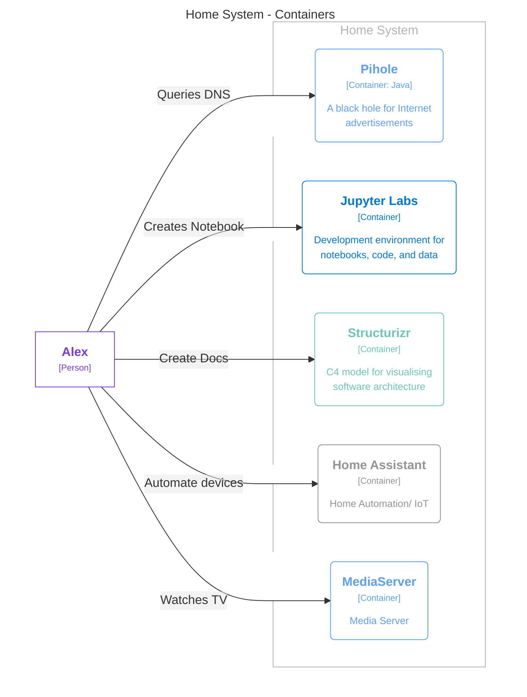

# Home System

## Mermaid client-side rendered diagram

```mermaid

graph TB
  linkStyle default fill:#ffffff

  subgraph diagram [Home System - Containers]
    style diagram fill:#ffffff,stroke:#ffffff

    1["<div style='font-weight: bold'>Alex</div><div style='font-size: 70%; margin-top: 0px'>[Person]</div>"]
    style 1 fill:#ffffff,stroke:#773adc,color:#773adc

    subgraph 5 [Home System]
      style 5 fill:#ffffff,stroke:#b3b3b3,color:#b3b3b3

      10("<div style='font-weight: bold'>MediaServer</div><div style='font-size: 70%; margin-top: 0px'>[Container]</div><div style='font-size: 80%; margin-top:10px'>Media Server</div>")
      style 10 fill:#ffffff,stroke:#5ea0ef,color:#5ea0ef
      6("<div style='font-weight: bold'>Pihole</div><div style='font-size: 70%; margin-top: 0px'>[Container: Java]</div><div style='font-size: 80%; margin-top:10px'>A black hole for Internet<br />advertisements</div>")
      click 6 http://tv.home:8080/admin/login.php "http://tv.home:8080/admin/login.php"
      style 6 fill:#ffffff,stroke:#5ea0ef,color:#5ea0ef
      7("<div style='font-weight: bold'>Jupyter Labs</div><div style='font-size: 70%; margin-top: 0px'>[Container]</div><div style='font-size: 80%; margin-top:10px'>Development environment for<br />notebooks, code, and data</div>")
      click 7 http://tv.home:8888/lab/ "http://tv.home:8888/lab/"
      style 7 fill:#ffffff,stroke:#0078d4,color:#0078d4
      8("<div style='font-weight: bold'>Structurizr</div><div style='font-size: 70%; margin-top: 0px'>[Container]</div><div style='font-size: 80%; margin-top:10px'>C4 model for visualising<br />software architecture</div>")
      click 8 http://tv.home:8066/workspace/diagrams "http://tv.home:8066/workspace/diagrams"
      style 8 fill:#ffffff,stroke:#6bc5b8,color:#6bc5b8
      9("<div style='font-weight: bold'>Home Assistant</div><div style='font-size: 70%; margin-top: 0px'>[Container]</div><div style='font-size: 80%; margin-top:10px'>Home Automation/ IoT</div>")
      click 9 http://tv.home:8123/ "http://tv.home:8123/"
      style 9 fill:#ffffff,stroke:#949494,color:#949494
    end

    1-- "<div>Queries DNS</div><div style='font-size: 70%'></div>" -->6
    1-- "<div>Creates Notebook</div><div style='font-size: 70%'></div>" -->7
    1-- "<div>Create Docs</div><div style='font-size: 70%'></div>" -->8
    1-- "<div>Automate devices</div><div style='font-size: 70%'></div>" -->9
    1-- "<div>Watches TV</div><div style='font-size: 70%'></div>" -->10
  end
```

## structurizr rendered diagram

